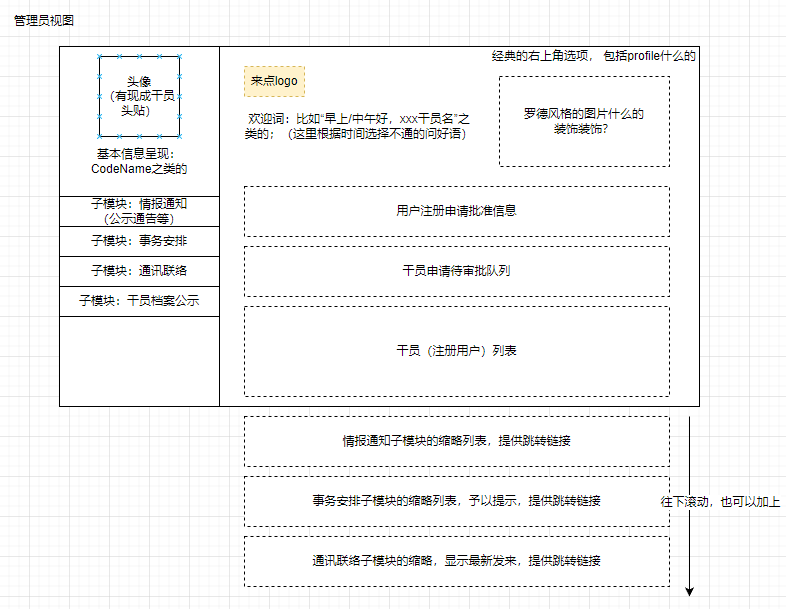
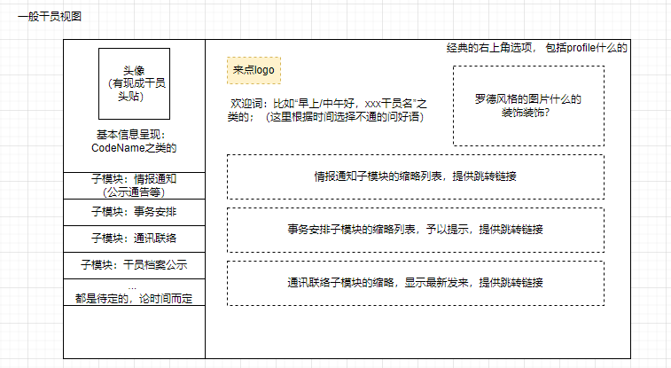

## 一、项目结构

项目总目录：运行`django-admin startproject db-project`得来

`/backend`：为django的app，在项目根目录中运行`django-admin startapp backend`得来

`/frontend`：为vue3项目，在项目根目录中运行`vue create frontend -n`得来（`-n`参数表示不自动添加.git）

## 二、项目构想

### 1. 主题

明日方舟——罗德岛管理系统（人事？）。模拟泰拉大陆上一家医药公司（罗德岛）的日常经营模式

### 2.风格基调

扁平化UI，动画以浮动为主，黑白色调为主辅助亮色点缀

### 3. 模块划分

#### ①用户管理系统

系统登录页面、注册跳转页面

基本表
| CodeName | PassWord | Permission |
| -- | -- | -- |
| char(30) | char(20) | tinyint |
| primary key | not null | not null, unsigned |
| | | 值越低，权限越高；最小为0 |

登录：CodeName、PassWord 输入与核对，然后根据权限跳转到各自主页面

注册：CodeName、PassWord。 Permission注册时默认最低。系统事先内置高权限用户（目前分0、1，称为管理员），通过管理员分配

拓展：
- 验证码
- 用户注册需经过管理员审批才能通过
- （如果有空的话）希望刚进页面时有一个动画，登录连接成功后有一个动画（类似[明日方舟官网](https://ak.hypergryph.com/)的效果）

#### ②登录后主页面

基本信息呈现。

（作业一要求的第二张表就选择存各用户profile的内容吧，比如头像、基本信息什么的）

----

管理员(Permission 0、1)

普通干员

#### ③侧边栏：情报通知模块

呈现通知、公告、表彰等一些列舰船内公关内容

管理员、授权用户组（比如凯太后）可编辑内容，类似于博客文章系统，提供支持markdown的编辑器；普通用户（一般干员）可留言评论

舰船航行位置（地图上标示）

各地办事处联络情报：卡西米尔、哥伦比亚、莱塔尼亚、龙门、尚蜀、伊比利亚、叙拉古...

干员借调公示：黑钢、莱茵生命

活动安排：日落即逝驻场演出、迎新会

#### ④侧边栏：月度事务安排

做一个月度日历，其上标示各种事项

资源采购

源石抑制剂、药物出口安排

手术排班（针对医疗干员们）

博士助理安排

基建管理：副手、制造站、贸易站、发电站、训练室

宿舍管理

食堂菜品公式（提供留言区）

#### ⑤侧边栏：即时通讯模块

可选择单独干员、干员组进行联络，简易版微信功能

#### ⑥干员档案公示

（解释：干员之间互相了解最直接的方式）

根据不同权限，显示不同详细程度的内容；各管理员可对内容进行些许评论

#### ⑥申请表单

申请研究经费，外勤、假期之类的

#### 4. 数据关系ER图

## 三、软件版本

### 后端相关
- python 3.10.6
- pip 22.2.1
- django 4.1.1 （根据官网提示下载的，`pip install Django==4.1.1`；`python -m django --version`查看）

**django rest framework**:
（都是pip安装，`pip list`即可查看所有）

- djangorestframework 3.14.0
- markdown  3.4.1
- django-filter 22.1

- django-filter

### 前端相关
- node.js v16.17.0 （官网下载的包再添加环境变量；`node -v`查看）
- npm 8.15.0 （node.js的包管理软件，应该自带；`npm -v`查看）
- cnpm （按菜鸟教程所说搞了个cnpm，[使用淘宝 NPM 镜像](https://www.runoob.com/nodejs/nodejs-npm.html#taobaonpm)）
- vue 3.2.39 （应该是使用`cnpm install vue@next`装的vue3；`npm list vue`查看）
- vite 3.1.3（新型前端构建工具，pycharm终端输入`npm init vite@latest frontend -- --template vue`，按提示安装`create-vite@latest`，再按提示完成`cd frontend`、`npm install`即安装完毕，`vite -v`查看）

#### 依赖的包
- element-plus(`npm install element-plus --save`)
- icon(`npm install @element-plus/icons-vue`)
- router(`npm install vue-router@4`)
- VueUse(`npm i @vueuse/core @vueuse/components`)
- axios(`npm install axios@0.26.1`)
- universal-cookie(`npm i universal-cookie`)
- integrations(`npm i @vueuse/integrations`)

### 数据库相关
- MySQL: 装了一堆，主要的都是8.0 

## 四、运行方法
- 后端：在项目根目录运行`python manage.py runserver`;若Pycharm有配置，也可直接点击run运行
- 前端：进入`/frontend`目录，在终端输入`npm run dev`（别忘记ctrl-c，再输入Y停止）
