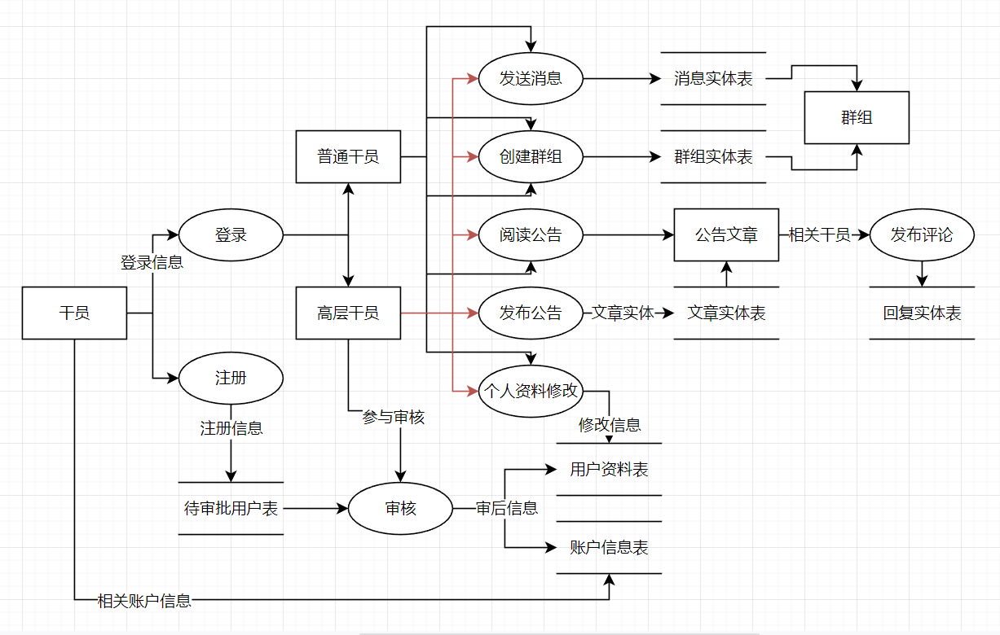
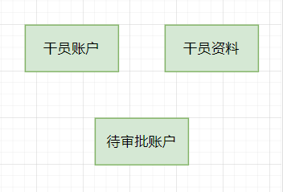
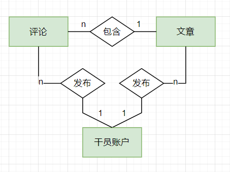
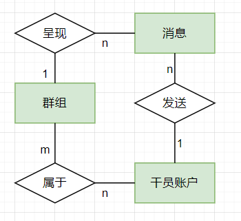
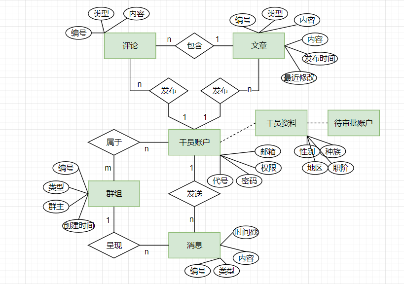

## 一、需求分析

### 1. 需求描述

​	明日方舟作为一款近年流行的二次元塔防游戏，以其宏大多元的世界观，精美独特的立绘美术，乐趣多样的关卡设计，广受玩家的好评。以这款游戏衍生的二次创作相当之多，而本项目也属于此。接受游戏的世界观设定，然后再与现实世界接轨，打破幻想和现实的鸿沟，有利于更好的拓展游戏内容，为既得玩家提供更多的乐趣，同时扩大潜在游戏受众，宣传游戏并让它的美好为更多人所熟知，便是需求的主体。

​	结合现实世界的公司管理，我们为游戏中名为“罗德岛”的公司设计相关的管理系统。

​	在被称为“泰拉大陆”的世界上，遍布着一种称为“源石”的奇特物质。它既能充当工业基石为社会城市提供能源，又会导致不治而具传染性的矿石病。不幸染病的人们被称作”感染者“，因矿石病而强大（掌握源石技艺），也因矿石病而早夭，死后身体化为新感染源，被普通人乃至社会国家所惧怕与厌弃。感染者和非感染者的矛盾是这片大地的历史基石，在此之上，文明在人性裹挟下演进，国家种群兴衰更迭。

​	有一群颇具理想主义的人汇聚一堂，构建了名为”罗德岛“的医药公司，在这片大地上踽踽独行。它研制并出售矿石病相关药物（缓解症状），收容治疗照顾感染者，介入并尝试缓解感染者纷争，研究探寻矿石病原理...罗德岛坐落于一艘大型陆行舰，各工作人员被称为“干员”，分别执行公司医疗、后勤、战斗、人事等职能。模拟罗德岛日常运行情景，我们设计一个**以干员为用户对象**的罗德岛管理系统，包含**情报通知**、**事务安排**、**联络通讯**、**档案公示**等模块，并**区分权限**便于管理。

​	而如果抛开一切设定不谈，此项目相当于一个公司管理系统的设计，同样具有较强的现实意义。

### 2. 数据流图

相关数据流图如下

### 3. 数据元素表

**用户信息表（user_account）**

| 数据项名字 | 数据类型 | 约束               | 备注                      |
| ---------- | -------- | ------------------ | ------------------------- |
| CodeName   | char(30) | primary key        | 代号；相当于用户名        |
| Password   | char(20) | not null           | 密码                      |
| Permission | tinyint  | not null, unsigned | 值越小，权限越高；最小为0 |
| Mail       | char(20) |                    | 邮件地址                  |

**用户资料表（user_profile）**

| 数据项名字 | 数据类型 | 约束        | 备注                |
| ---------- | -------- | ----------- | ------------------- |
| CodeName   | char(30) | primary key | 代号；相当于用户名  |
| Gender     | tinyint  |             | 性别（二值：男/女） |
| Class      | char(20) |             | 职业分类            |
| Region     | char(30) |             | 地区                |
| Race       | char(20) |             | 种族                |
| Avatar     | blob     |             | 头像                |
| Bio        | tinytext |             | 自述                |

**待审批用户表（account_approve_queue）**

| 数据项名字  | 数据类型 | 约束        | 备注               |
| ----------- | -------- | ----------- | ------------------ |
| CodeName    | char(30) | primary key | 代号；相当于用户名 |
| Password    | char(20) | not null    | 密码               |
| Permission  | tinyint  | unsigned    | 待管理员分配       |
| Gender      | tinyint  |             | 性别               |
| Class       | char(20) |             | 职业分类           |
| Region      | char(30) |             | 地区               |
| Race        | char(20) |             | 种族               |
| Description | text     |             | 备注               |

**文章实体表（passage）**

| 数据项名字   | 数据类型  | 约束                  | 备注                               |
| ------------ | --------- | --------------------- | ---------------------------------- |
| PId          | int       | primary key           | 文章编号                           |
| Title        | char(45)  | not null              | 标题（15个中文字）                 |
| Poster       | char(30)  | not null, foreign key | 发布者（CodeName）                 |
| PostDate     | timestamp | not null              | 发布时间                           |
| LastEditor   | char(30)  | not null, foreign key | 最后编辑者（CodeName）             |
| LastEditTime | timestamp | not null              | 最后编辑时间                       |
| Content      | text      | not null              | 内容，64KB（21845个中文字）        |
| Type         | tinyint   | not null              | 文章类别：公告、晋升公示、地区情报 |

**回复实体表（reply）**

| 数据项名字  | 数据类型 | 约束                  | 备注                  |
| ----------- | -------- | --------------------- | --------------------- |
| RId         | int      | primary key           | reply编号             |
| Replier     | char(30) | not null, foreign key | 回复者（CodeName）    |
| AttachedPId | int      | not null, foreign key | 依附的文章编号（PId） |
| Content     | tinytext | not null              |                       |

**消息实体表（message)**

| 数据项名字   | 数据类型  | 约束                  | 备注               |
| ------------ | --------- | --------------------- | ------------------ |
| MId          | int       | primary key           | message编号        |
| Type         | tinyint   | not null              | 对个人-0；对群组-1 |
| SendFrom     | char(30)  | not null, foreign key | 发送方             |
| SendToPerson | char(30)  | foreign key           | 接收个人           |
| SendToGroup  | int       | foreign key           | 接收群组           |
| ContentText  | tinytext  | not null              | 消息文本           |
| Picture      | blob      |                       | 图像信息           |
| Time         | timestamp | not null              | 发布时间           |

**群组实体表（group）**

| 数据项名字 | 数据类型  | 约束                  | 备注                       |
| ---------- | --------- | --------------------- | -------------------------- |
| GId        | int       | primary key           | group编号                  |
| GName      | char(30)  | not null              | group名                    |
| Owner      | char(30)  | not null, foreign key | 群主，初建为创建该群的干员 |
| BornTime   | timestamp | not null              | 群组创建时间               |

**用户-群组关系表（operator_group）**

| 数据项名字 | 数据类型 | 约束                     | 备注                   |
| ---------- | -------- | ------------------------ | ---------------------- |
| GId        | int      | primary key, foreign key | group编号              |
| CodeName   | char(30) | primary key, foreign key | 干员名称，得是已有用户 |
| isOwner    | tinyint  |                          | 是否是群组             |

## 二、数据库概念模式设计

### 1. 系统初步E-R图

省略了相关属性项

#### （1）账户管理子模块

这一块各表之间不存在固化的关系实体，而是数据流的关系

#### （2）情报通知子模块

#### （3）通讯联络子模块

### 2. 系统基本E-R图

>  时间和管理的不恰当导致原计划的ER图未能完全实现，以上呈现的为局部

## 三、数据库逻辑模式设计

### 1. 数据库关系模式	

> 记：加粗为主键，下划线为外键

**（1）文章实体表（passage）**

Passage(**PId**, Title, Type, <u>Poster</u>, PostDate, LastEditor, LastEditTime, Content)

| 数据项名字   | 数据类型  | 约束                  | 备注                               |
| ------------ | --------- | --------------------- | ---------------------------------- |
| PId          | int       | primary key           | 文章编号                           |
| Title        | char(45)  | not null              | 标题（15个中文字）                 |
| Poster       | char(30)  | not null, foreign key | 发布者（CodeName）                 |
| PostDate     | timestamp | not null              | 发布时间                           |
| LastEditor   | char(30)  | not null, foreign key | 最后编辑者（CodeName）             |
| LastEditTime | timestamp | not null              | 最后编辑时间                       |
| Content      | text      | not null              | 内容，64KB（21845个中文字）        |
| Type         | tinyint   | not null              | 文章类别：公告、晋升公示、地区情报 |

**（2）回复实体表（reply）**

Reply(**RId**, <u>Replier</u>, <u>AttachedPId</u>, Content)

| 数据项名字  | 数据类型 | 约束                  | 备注                  |
| ----------- | -------- | --------------------- | --------------------- |
| RId         | int      | primary key           | reply编号             |
| Replier     | char(30) | not null, foreign key | 回复者（CodeName）    |
| AttachedPId | int      | not null, foreign key | 依附的文章编号（PId） |
| Content     | tinytext | not null              |                       |

**（3）消息实体表（message)**

Message(**MId**, Type, <u>SendFrom</u>, <u>SendToPerson</u>, <u>SendToGroup</u>, ContentText, Picture, Time)

| 数据项名字   | 数据类型  | 约束                  | 备注               |
| ------------ | --------- | --------------------- | ------------------ |
| MId          | int       | primary key           | message编号        |
| Type         | tinyint   | not null              | 对个人-0；对群组-1 |
| SendFrom     | char(30)  | not null, foreign key | 发送方             |
| SendToPerson | char(30)  | foreign key           | 接收个人           |
| SendToGroup  | int       | foreign key           | 接收群组           |
| ContentText  | tinytext  | not null              | 消息文本           |
| Picture      | blob      |                       | 图像信息           |
| Time         | timestamp | not null              | 发布时间           |

**（4）群组实体表（group）**

Group(**GId**, GName, Owner, BornTime)

More Actions数据项名字数据类型约束备注GIdintprimary keygroup编号GNamechar(30)not nullgroup名Ownerchar(30)not null, foreign key群主，初建为创建该群的干员BornTimetimestampnot null群组创建时间

**（5）用户-群组关系表（operator_group）**

Operator-Group(<u>**GId**</u>, <u>**CodeName**</u>, isOwner)

> （GId, CodeName）→ isOwner 

| 数据项名字 | 数据类型 | 约束                     | 备注                   |
| ---------- | -------- | ------------------------ | ---------------------- |
| GId        | int      | primary key, foreign key | group编号              |
| CodeName   | char(30) | primary key, foreign key | 干员名称，得是已有用户 |
| isOwner    | tinyint  |                          | 是否是群组             |

**（6）用户信息表（user_account）**

UserAccount(**CodeName**, Password, Permission, Mail)

| 数据项名字 | 数据类型 | 约束               | 备注                      |
| ---------- | -------- | ------------------ | ------------------------- |
| CodeName   | char(30) | primary key        | 代号；相当于用户名        |
| Password   | char(20) | not null           |                           |
| Permission | tinyint  | not null, unsigned | 值越小，权限越高；最小为0 |
| Mail       | char(20) |                    | 邮件地址                  |

**（7）用户资料表（user_profile）**

UserProfile(**CodeName**, Gender, Class, Region, Race, Avatar, Bio)

| 数据项名字 | 数据类型 | 约束        | 备注               |
| ---------- | -------- | ----------- | ------------------ |
| CodeName   | char(30) | primary key | 代号；相当于用户名 |
| Gender     | tinyint  |             | 性别（二值）       |
| Class      | char(20) |             | 职业分类           |
| Region     | char(30) |             | 地区               |
| Race       | char(20) |             | 种族               |
| Avatar     | blob     |             | 头像               |
| Bio        | tinytext |             | 自述               |

**（8）待审批用户表（account_approve_queue）**

AccountApproveQueue(**CodeName**, Password, Permission, Gender, Class, Region, Race, Avatar, Bio)

| 数据项名字  | 数据类型 | 约束        | 备注               |
| ----------- | -------- | ----------- | ------------------ |
| CodeName    | char(30) | primary key | 代号；相当于用户名 |
| Password    | char(20) | not null    | 密码               |
| Permission  | tinyint  | unsigned    | 待管理员分配       |
| Gender      | tinyint  |             | 性别               |
| Class       | char(20) |             | 职业分类           |
| Region      | char(30) |             | 地区               |
| Race        | char(20) |             | 种族               |
| Description | text     |             | 备注               |

### 2. 关系模式范式等级的判定与规范化

自然的，关系模式符合1NF；

观察关系模式可知，所有的依赖均起源于主属性，所以符合3NF；

其实所有的依赖起源都是码，所以符合BCNF

### 3. 数据库设计优化

#### （1）用户信息表和用户资料表的分离

原本两者合而为一张表，登录注册等账户相关操作所调用的表，与用户修改更新个人信息的表是同一张。考虑到两个操作之间具有独立性，将其分开逻辑更加清晰，进行表选择时冗余小占用内存更少

#### （2）使用外键

使用外键来保证数据的关联性并提高访问速度，同时从逻辑的角度保证数据库的设计功能正确执行到位。

#### （3）使用Django模型

使用了Django的对象关系映射（ORM），将视线专注于逻辑设计，将底层处理交给框架；同时采用了DjangoRestFramework，更好的与前端应用交互。

