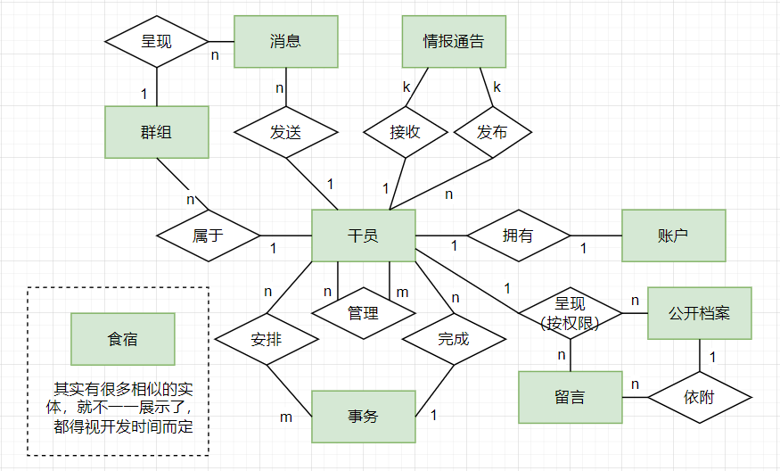

# P.R.T.S.罗德岛管理系统

## 一、小组名单与分工

| 姓名   | 学号     | 分工                             |
| ------ | -------- | -------------------------------- |
| 俞逸洋 | 20373569 | Web前端开发、UI界面设计          |
| 夏瑞斌 | 20373585 | 数据库与项目构架设计、前后端支援 |
| 赵雨晨 | 20373586 | Web后端开发、请求处理            |

## 二、主题与内容说明

本项目基于《明日方舟》游戏中的虚拟世界观构架而成。

在被称为“泰拉大陆”的世界上，遍布着一种称为“源石”的奇特物质。它既能充当工业基石为社会城市提供能源，又会导致不治而具传染性的矿石病。不幸染病的人们被称作”感染者“，因矿石病而强大（掌握源石技艺），也因矿石病而早夭，死后身体化为新感染源，被普通人乃至社会国家所惧怕与厌弃。感染者和非感染者的矛盾是这片大地的历史基石，在此之上，文明在人性裹挟下演进，国家种群兴衰更迭。

有一群颇具理想主义的人汇聚一堂，构建了名为”罗德岛“的医药公司，在这片大地上踽踽独行。它研制并出售矿石病相关药物（缓解症状），收容治疗照顾感染者，介入并尝试缓解感染者纷争，研究探寻矿石病原理...罗德岛坐落于一艘大型陆行舰，各工作人员被称为“干员”，分别执行公司医疗、后勤、战斗、人事等职能。模拟罗德岛日常运行情景，我们设计一个**以干员为用户对象**的罗德岛管理系统，包含**情报通知**、**事务安排**、**联络通讯**、**档案公示**等模块，并**区分权限**便于管理。

倘若疲于接受相应世界观，不妨将其视为一个简单的公司管理系统。

### 系统初步E-R图

### 系统初步数据表

#### 用户信息表（user_account）

| 数据项名字 | 数据类型 | 约束               | 备注                      |
| ---------- | -------- | ------------------ | ------------------------- |
| CodeName   | char(30) | primary key        | 代号；相当于用户名        |
| PassWord   | char(20) | not null           |                           |
| Permission | tinyint  | not null, unsigned | 值越小，权限越高；最小为0 |

 #### 待审批用户表（account_approve_queue）

| 数据项名字 | 数据类型 | 约束        | 备注               |
| ---------- | -------- | ----------- | ------------------ |
| CodeName   | char(30) | primary key | 代号；相当于用户名 |
| PassWord   | char(20) | not null    |                    |
| Class      | char(20) |             | 职业分类           |
| Region     | char(30) |             | 地区               |
| ...        |          |             |                    |

### 系统初步展示结构

- 个人账户Profile
- 情报通知模块：通知公告（markdown编辑）、舰船位置、活动安排、干员借调
- 事务安排模块：月度事务排班信息发布与提醒、基建管理
- 即时通讯模块：模仿通讯系统实现实时消息传递
- 档案公示模块：了解其他干员的官方渠道、内容按权限展示
- ...

